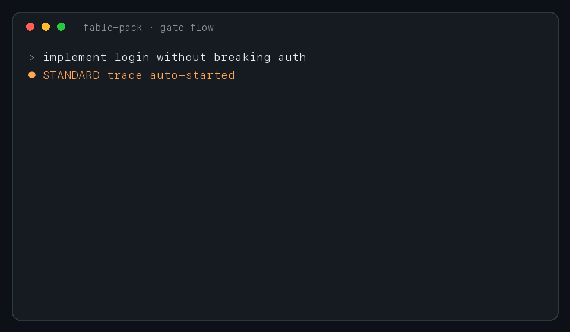

# fable-pack

[한국어](README.ko.md)

Engineering decision records & quality gates for Claude Code sessions

AI coding sessions vanish when they end — why requirements were read a certain way, which alternatives were rejected, what counted as done. fable-pack persists those decisions (requirement interpretation, context-selection rationale, rejected alternatives, acceptance criteria, verification evidence) as structured documents inside your project, and blocks implementation edits until the spec exists. Output feeds code review, audits, retrospectives, onboarding.

Records visible artifacts only — never private chain of thought.



## Install

```text
/plugin marketplace add SihyeonJeon/fable-pack
/plugin install fable-pack@fable-pack-marketplace
```

- Requires `python3` (stdlib only; PyYAML optional)
- Remove: `/plugin uninstall fable-pack`

## Recording on / off

```text
/fable-pack:on     on — persists across sessions until off
/fable-pack:off    off
```

The toggle is handled by a hook, never sent to the model — zero tokens. While on, every prompt is auto-classified:

| Prompt | Behavior |
| --- | --- |
| questions, chatter | ambient logging only — nothing blocked |
| implement, fix, refactor | STANDARD trace auto-starts + gates |
| auth, payments, migration, security | HEAVY trace auto-starts + stricter gates |

While gated: implementation edits are blocked until `context_pack.yaml`, `task_spec/final.yaml`, decision events, and observations are filled.

## What gets recorded automatically

- user prompts
- file reads / edits, searches, command runs
- plan-mode plans (full text), todo decompositions
- subagent dispatch prompts
- assistant response text
- session boundaries, compaction events

## Manual commands

```text
/fable-pack:start <goal>    start a trace with explicit grade
/fable-pack:status          active task and gate status
/fable-pack:timeline        merged timeline — prompt→reads→observations→decisions→edits
/fable-pack:done            close through the done gate
/fable-pack:shadow <model>  scaffold a comparison-trace pair (documentation-gap analysis)
/fable-pack:promote         promote a reviewed trace into the corpus
```

Direct CLI:

```sh
python3 <plugin-root>/adapters/claude-code/scripts/pack task start --goal "..." --grade HEAVY
python3 <plugin-root>/adapters/claude-code/scripts/pack validate --gate all
python3 <plugin-root>/adapters/claude-code/scripts/pack corpus promote --task-id <id>
```

## See the data without installing

[`examples/trace-bugfix/`](examples/trace-bugfix/) — a real, sanitized trace of a bug fix in this repo: goal interpretation, context pack with selection rationale, decision events (including rejected alternatives), observations, verifier report, and the reconstructed [timeline](examples/trace-bugfix/timeline.txt).

## Model gating

A personal scoping safeguard: the pack acts only in sessions you chose to record. Model detection reads the session transcript (`/model` switches apply immediately). If the model id lacks `fable`, or recording is off:

- nothing recorded
- nothing blocked
- nothing injected into context — zero token cost
- nothing written to disk

## Token cost

Recording runs in harness-side hook processes — it consumes no model tokens. Only behavior-changing signals enter agent context:

| Injected | When | Size |
| --- | --- | --- |
| session status line | session start in an `on` project | ~30 tok |
| gate escalation notice | once, when a trace auto-starts | ~90 tok |
| gate block reasons | full text only when the error list changes; one line if identical | varies |
| done-gate warning | only on state change | varies |
| slash command metadata | always | ~100 tok |

Repetition is suppressed by hashing the error list — new errors always reprint in full. Re-reads never duplicate observation placeholders, and the agent's own bookkeeping reads of `fable-disk/` are excluded from logs (no self-recording loop).

## Data security

- Local only — plain files under your project's `fable-disk/`; no network calls, no telemetry anywhere in the code (stdlib file I/O, auditable in an afternoon)
- Secret redaction — `sk-…`, `ghp_…`, `AKIA…`, JWTs, `Bearer …`, `KEY=value` patterns masked before writing
- No chain of thought — only visible response text is extracted from transcripts; thinking blocks are skipped explicitly
- Leak paths closed — gitignore `fable-disk/`; bulk delete via `uninstall.sh --purge-data`
- Bypass audit — `PACK_BYPASS=1` use is recorded in meta and bars the trace from corpus promotion

## Data layout

Everything lands in the project you are working in (not this repo):

```text
<your-project>/fable-disk/
  trace/<task-id>/    prompts, read/edit/command logs, decision events, spec, verifier report
  corpus/             review-approved exemplars, distilled checklist rules
```

Full trace layout and gate rules: [fable-pack/README.md](fable-pack/README.md)

## Corpus workflow

1. `/fable-pack:on` — leave it on, work normally
2. work-shaped prompts auto-start gated traces; gates force the spec to be written
3. `/fable-pack:done` — close after verification evidence
4. set a rating in `human_review.yaml` — `exemplary` / `normal` / `flawed`
5. `/fable-pack:promote` — into `corpus/fable_golden/` or `flawed_examples/`
6. optional: `pack rules export` — share distilled rules only ([contributing](CONTRIBUTING.md)); secrets and trace identifiers stripped automatically

## Roadmap

Under exploration, not claimed as proven:

- **Cross-model process transfer** — whether a corpus of gated decision traces (specs, checklists, rubrics distilled from `corpus/`) measurably improves the planning quality of a different model session following the same gates. Requires shadow-pair comparisons and judged before/after evidence; the `shadow`/`counterfactual` tooling exists, the benchmark does not yet.
- Semantic (not keyword) shadow-delta comparison
- Example gallery from community-contributed rule packs

## Development

```sh
python3 -m unittest tests.test_pack_smoke    # 48 tests
```

- `fable-pack/core/` — lib, schemas, rules, protocols
- `fable-pack/adapters/claude-code/` — hooks, CLI, installers
- `fable-pack/commands/` — slash commands
- `fable-pack/hooks/hooks.json` — plugin hook manifest
- Per-project install: `sh fable-pack/adapters/claude-code/install.sh` / remove: `uninstall.sh`
